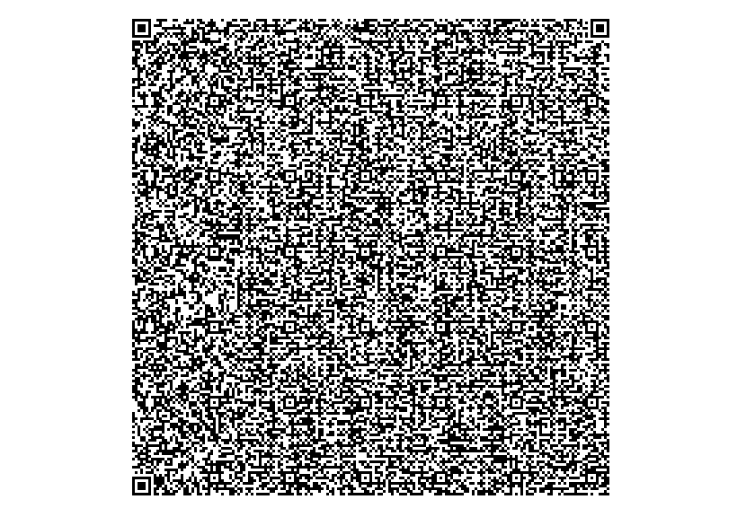

# Apple II HGR QR Code Generator

6502 assembly QR encoder that renders directly to the Apple II high-resolution graphics page.

## Overview

Generates QR codes Version 1–40 (21×21 to 177×177 modules) directly on the Apple II
HGR display without any host-side processing. Key properties:

- QR versions 1–40, EC level L, mask pattern 0
- Output renders to HGR page 1 (`$2000`) or HGR page 2 (`$4000`)
- Binary is **3779 bytes** (~3.7 KB), loads at `$6000`–`$6EC2`
- Supports up to **2953 bytes** of input data (V40 capacity at EC level L)
- Reed-Solomon error correction computed entirely in 6502 code using GF(256)

## Examples

### V2 — Small QR code (up to 32 bytes)


*"GITHUB.COM/BADVISION" encoded as a V2 QR code, rendered at 1:1 pixel-to-module ratio on the Apple II 280×192 HGR display.*

### V40 — Maximum size (up to 2953 bytes)



*2860-byte payload encoded as a V40 (177×177) QR code, nearly filling the entire Apple II HGR screen.*

## Building

```
make
```

Requires the [ACME cross-assembler](https://sourceforge.net/projects/acme-crossass/).

```
make labels    # also dump label addresses to labels.txt
make clean     # remove qr.bin and labels.txt
```

## Calling Convention

Set the following zero-page locations before calling `JSR $6000`:

| ZP Address | Label     | Width | Description                                        |
|------------|-----------|-------|----------------------------------------------------|
| `$EB–$EC`  | `ZP_SRC`  | 2 B   | Lo/hi address of the input data buffer             |
| `$ED–$EE`  | `ZP_LEN`  | 2 B   | Lo/hi length of input data in bytes                |
| `$EF`      | `ZP_PAGE` | 1 B   | `0` = HGR page 1 (`$2000`), `1` = page 2 (`$4000`) |

**Returns:** carry clear on success; carry set with `A = $FF` if data is too long for any
QR version (more than 2953 bytes).

### 6502 Example

```asm
; Encode the 5-byte string at $0300 onto HGR page 1
LDA #$00
STA $EB       ; ZP_SRC lo = $00
LDA #$03
STA $EC       ; ZP_SRC hi = $03  (data at $0300)
LDA #5
STA $ED       ; ZP_LEN lo = 5
LDA #0
STA $EE       ; ZP_LEN hi = 0
STA $EF       ; ZP_PAGE  = 0 (HGR page 1)
JSR $6000
BCS error     ; carry set = data too long
```

### Applesoft BASIC Setup (via POKE + CALL)

```basic
10  REM Store string at $0300
20  FOR I = 0 TO 4: POKE 768+I, ASC(MID$("HELLO",I+1,1)): NEXT I
30  POKE 235,0  : POKE 236,3   : REM ZP_SRC = $0300
40  POKE 237,5  : POKE 238,0   : REM ZP_LEN = 5
50  POKE 239,0                  : REM ZP_PAGE = 0
60  CALL 24576                  : REM JSR $6000
```

## Direct execution via Monitor

Load the program, set up the zero-page registers and start it.  This example sets the data starting at $300, 5 bytes long, using hires page 1:

```
]BLOAD QR.BIN,A$6000
]CALL-151
*EB:0 3 5 0 0
*300:68 65 6C 6C 6F
*6000G      ; from monitor, with ZP already set
```

## Memory Layout

| Region             | Address Range     | Size   | Description                              |
|--------------------|-------------------|--------|------------------------------------------|
| Code + tables      | `$6000`–`$6EC2`   | 3779 B | Assembled binary (load here)             |
| HGR page 1         | `$2000`–`$3FFF`   | 8 KB   | Output when `ZP_PAGE = 0`                |
| HGR page 2         | `$4000`–`$5FFF`   | 8 KB   | Output when `ZP_PAGE = 1`                |
| Codeword buffer    | `$9000`–`$9EFF`   | 3840 B | Data + EC codewords (runtime scratch)    |
| GF(256) log table  | `$9F00`–`$9FFF`   | 256 B  | Built at runtime by `GF_BUILD_TABLES`    |
| GF(256) antilog    | `$A000`–`$A0FF`   | 256 B  | Built at runtime by `GF_BUILD_TABLES`    |
| RS generator poly  | `$A100`–`$A11F`   | 32 B   | Built at runtime by `RS_GEN_POLY`        |
| RS remainder       | `$A120`–`$A13F`   | 32 B   | Working buffer for `RS_ENCODE_BLOCK`     |
| Interleave scratch | `$A200`–`$B0EA`   | ~3.7 KB| Used by `QR_INTERLEAVE` (V6+ only)       |

### Zero-Page Usage

| Address      | Label       | Width | Purpose                                      |
|--------------|-------------|-------|----------------------------------------------|
| `$06`–`$07`  | `ZP_PTR`    | 2 B   | General pointer (owned by `INVERT_PIXEL`)    |
| `$08`–`$09`  | `ZP_PTR2`   | 2 B   | Second pointer / bit-mask for `PACK_BITS`    |
| `$0A`–`$0B`  | `ALN_BASE`  | 2 B   | Alignment position list pointer              |
| `$CE`        | `ZP_ROW`    | 1 B   | Current QR row                               |
| `$CF`        | `ZP_COL`    | 1 B   | Current QR column                            |
| `$D7`        | `ZP_SIZE`   | 1 B   | Modules per side = `4 * VER + 17`            |
| `$E3`        | `ZP_VER`    | 1 B   | QR version (1–40)                            |
| `$E6`        | `HPAG`      | 1 B   | HGR page base hi-byte (set by ROM firmware)  |
| `$EB`–`$EC`  | `ZP_SRC`    | 2 B   | **Caller sets:** input data address          |
| `$ED`–`$EE`  | `ZP_LEN`    | 2 B   | **Caller sets:** input data length           |
| `$EF`        | `ZP_PAGE`   | 1 B   | **Caller sets:** 0 = page 1, 1 = page 2      |
| `$FA`        | `ZP_CBIT`   | 1 B   | Bit offset / RS block counter                |
| `$FB`        | `ZP_TMP`    | 1 B   | Scratch (clobbered by `GF_MUL`)              |
| `$FC`        | `ZP_TMP2`   | 1 B   | Scratch / `n_ec` in RS encode                |
| `$FD`–`$FE`  | `ZP_BITPOS` | 2 B   | Bit-stream index / RS feedback register      |

All zero-page locations were chosen from regions verified safe when Applesoft BASIC
is not actively running (Integer BASIC scratch, Sweet-16 scratch, and Applesoft math temps).

## Theory of Operation

`QR_GENERATE` at `$6000` runs the full encoding pipeline in eleven steps:

### 1. Version Selection — `QR_SELECT_VER`

Walks `CAP_TABLE` (80 bytes, 2 bytes per version) using a 16-bit comparison of
`ZP_LEN` against the L-level byte capacity for each version from V1 to V40. Returns
the smallest version that fits; sets carry on overflow. Sets `ZP_SIZE = 4*VER + 17`.

### 2. GF(256) Table Construction — `GF_BUILD_TABLES`

Builds 256-entry log and antilog tables into `$9F00` and `$A000` at runtime.
Field: GF(2^8) with primitive polynomial `x^8+x^4+x^3+x^2+1` (0x11D), generator α = 2.

### 3. Data Encoding — `QR_ENCODE_DATA`

Produces the data codeword stream in `CODEWORD_BUF` (`$9000`):

- **Mode indicator**: 4 bits — `0100` (byte mode)
- **Character count**: 8 bits for V1–9, 16 bits for V10–40
- **Data bytes**: verbatim from `ZP_SRC`
- **Terminator**: up to 4 zero bits
- **Bit padding**: zero bits to the next byte boundary
- **Byte padding**: alternating `0xEC` / `0x11` until all data codeword capacity is filled

The total data codeword count comes from `BLK_PARAMS` (5 bytes per version: `ecpb, b1, d1, b2, d2`).

### 4. Reed-Solomon Error Correction — `QR_RS_ALL_BLOCKS`

Encodes every block for the selected version. `RS_GEN_POLY` builds the generator
polynomial once (same degree `ecpb` for all blocks in a version). `RS_ENCODE_BLOCK`
runs the LFSR polynomial remainder algorithm over each block's data bytes using GF(256)
multiply via log/antilog table lookup. EC bytes are appended contiguously after all
data bytes in `CODEWORD_BUF`.

### 5. Codeword Interleaving — `QR_INTERLEAVE`

No-op for V1–5 (single block). For V6+, interleaves data bytes and then EC bytes from
all blocks into the final sequence required by the QR spec, writing to `INTERLEAVE_BUF`
(`$A200`) then copying back to `CODEWORD_BUF`.

### 6. HGR Initialization — `HGR_INIT`

Calls Apple II ROM firmware (`$F3E2` for page 1, `$F3D8` for page 2) to clear the HGR
page to all-white (`$7F` per byte) and activate the display.

### 7. Function Patterns — `DRAW_FINDERS`, `DRAW_TIMING`, `DRAW_ALIGNMENT`, `DRAW_DARKMOD`

Draws the three 7×7 finder patterns (with 1-module white separators), the horizontal
and vertical timing strips (alternating dark/light modules along row 6 and column 6),
alignment patterns for V2+ (5×5 squares at positions from `ALN_DATA`), and the single
mandatory dark module at `(4*VER+9, 8)`.

### 8. Format Information — `FORMAT_INFO`

Places the pre-computed 15-bit BCH(15,5) format word for EC level L / mask 0
(`0x77C4`, stored in `FMT_INFO_L`) into both format information regions:

- **Region 1**: column 8 (rows 0–8, skipping row 6) and row 8 (columns 0–8, skipping column 6)
- **Region 2**: column 8 (rows `SIZE-7` to `SIZE-1`) and row 8 (columns `SIZE-8` to `SIZE-1`)

### 9. Version Information — `VERSION_INFO`

For V7+, places the 18-bit BCH(18,6) version word (from `VER_INFO_WORDS` table) into the
two 3×6 version information regions: top-right (rows 0–5, columns `SIZE-11` to `SIZE-9`)
and bottom-left (rows `SIZE-11` to `SIZE-9`, columns 0–5).

### 10. Data Placement — `PLACE_DATA`

Zigzag column-pair scan from bottom-right to top-left, skipping all function module
positions (tested by `IS_FUNC_MODULE`). Applies **mask pattern 0**: inverts any module
where `(row + col) mod 2 == 0`. One `INVERT_PIXEL` call per dark module; white modules
require no action on the all-white background.

## HGR Display Notes

The Apple II HGR display is 280×192 pixels. Each byte encodes 7 pixels in bits 6–0
(bit 7 selects the color palette and is kept zero for monochrome output). Row addressing
uses an interleaved memory layout; `INVERT_PIXEL` handles the address calculation via
the `ROW_OFS_LO` / `ROW_OFS_HI` tables.

- HGR is initialized all-white (`$7F` per byte); `INVERT_PIXEL` XORs exactly one bit to
  set a module dark — one call, no need to read-modify-write the logical pixel value
- V1 (21×21) occupies the top-left 21×21 pixels of the 280×192 display
- V40 (177×177) fills 177/280 of the width and 177/192 of the height
- No quiet zone is added; the QR code is drawn flush to the top-left corner.
  The QR spec requires a 4-module quiet zone; some scanners will require manual framing
  or zooming out before they decode cleanly

## GF(256) Implementation

Field: GF(2^8), irreducible polynomial `x^8 + x^4 + x^3 + x^2 + 1` (0x11D), generator α = 2.

Log and antilog (exp) tables are computed at runtime into `$9F00` and `$A000` to avoid
512 bytes of table data in the binary. Multiplication uses the identity
`a * b = alog[(log[a] + log[b]) mod 255]` with special-casing for zero operands.

## Source File Map

| File          | Contents                                                        |
|---------------|-----------------------------------------------------------------|
| `qr.asm`      | Entry point (`QR_GENERATE`), pipeline sequencing, `QR_RS_ALL_BLOCKS` |
| `zp.asm`      | Zero-page equates (no bytes emitted)                            |
| `hgr.asm`     | `HGR_INIT`, `INVERT_PIXEL`, `HGR_FILLROW`                       |
| `rs.asm`      | `GF_BUILD_TABLES`, `GF_MUL`, `RS_GEN_POLY`, `RS_ENCODE_BLOCK`, `RS_COPY_EC` |
| `matrix.asm`  | `IS_FUNC_MODULE`, `IS_ALIGN_MODULE`, `DRAW_FINDER`, `DRAW_FINDERS`, `DRAW_TIMING`, `DRAW_ALIGNMENT`, `DRAW_DARKMOD` |
| `encode.asm`  | `QR_SELECT_VER`, `PACK_BITS`, `QR_ENCODE_DATA`, `MUL8`, `QR_INTERLEAVE` |
| `place.asm`   | `PLACE_DATA`, zigzag scan with mask 0                           |
| `format.asm`  | `FORMAT_INFO`, `VERSION_INFO`                                   |
| `tables.asm`  | `ROW_OFS_LO/HI`, `CAP_TABLE`, `BLK_PARAMS`, `ALN_IDX`, `ALN_DATA`, `VER_INFO_WORDS`, `FMT_INFO_L` |

## Limitations

- **EC level L only** — highest data capacity, lowest error correction (7% recovery)
- **Mask pattern 0 only** — `(row + col) mod 2 == 0`; other masks are not evaluated
- **No quiet zone** — the QR spec requires a 4-module white border around the symbol;
  this implementation draws the code flush to the pixel origin
- **1:1 pixel-to-module ratio** — for small versions (V1–V5), phone camera scanners may
  need to be held close or the display zoomed in for reliable decoding
- `QR_INTERLEAVE` advances the source pointer per block for every `j` position regardless
  of whether that block contributed a byte at that `j` — this matches the spec for
  contiguous-block memory layout but differs from a pointer-array approach
